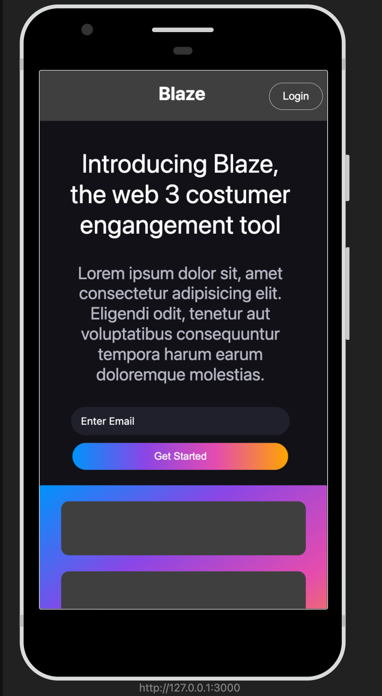

# Blaze



Blaze is a powerful web 3 customer engagement tool that allows you to connect with your audience in innovative ways. Whether you're looking to enhance user experiences or improve customer interactions, Blaze has you covered.

## Features

- **Intuitive Interface**: Blaze provides an easy-to-use interface that streamlines your customer engagement efforts.

- **Data Insights**: Gain valuable insights into customer behavior and preferences to make informed decisions.

- **Real-time Communication**: Engage with your customers in real-time through chat, notifications, and more.

- **Customization**: Tailor Blaze to your specific needs with customizable templates and designs.

## Getting Started

To get started with Blaze, simply sign up and explore our range of features. You'll be on your way to creating dynamic and engaging customer experiences in no time.

## Installation

You can include Blaze in your project by adding the following CSS file:

```html
<link rel="stylesheet" href="blaze.css">
```

## Usage

To use Blaze in your web application, follow these steps:

1. Include the Blaze CSS file in your HTML.

```html
<link rel="stylesheet" href="blaze.css">
```

2. Add the Blaze HTML components to your web pages.

```html
<div id="nav">
    <!-- Navigation content -->
</div>

<div class="body1">
    <!-- Blaze content -->
</div>
```

3. Customize the appearance and behavior of Blaze to match your requirements.

## Contributing

We welcome contributions from the community. If you have ideas for improving Blaze or want to report an issue, please [create a GitHub issue](https://github.com/yourusername/blaze/issues) or submit a pull request.

## License

Blaze is licensed under the [MIT License](LICENSE).

---

[Visit Blaze](https://www.blaze-tool.com) | [GitHub Repository](https://github.com/yourusername/blaze)

© 2023 Blaze Inc.
```

Replace `./blaze-logo.png` with the actual path to your Blaze logo image. You can modify the content and structure of this README to match your project's specifics.